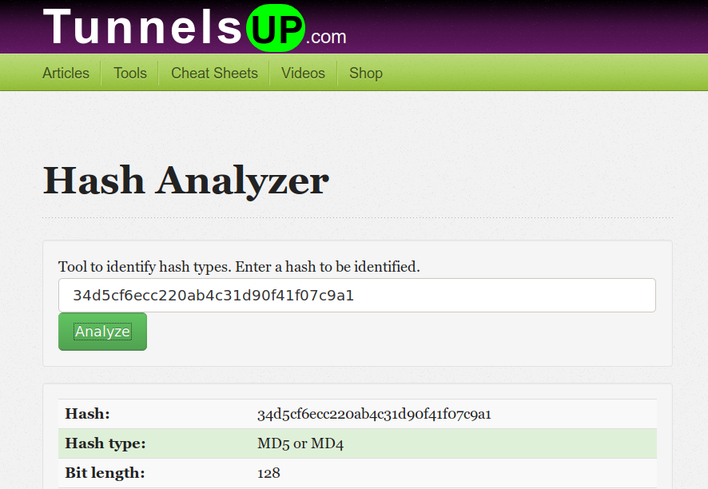
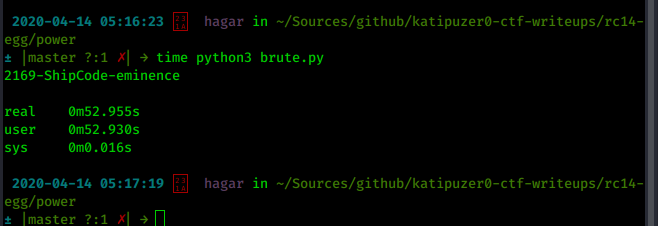
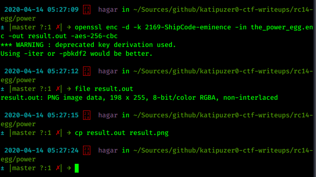
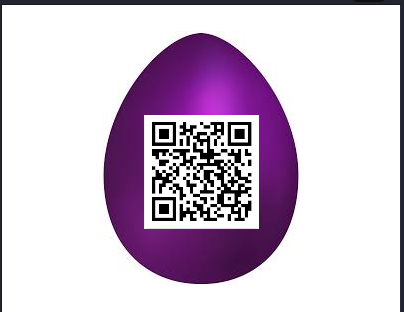

# Power
by katipuzer0

In this problem, we are given an encrypted file and some hints on the 
type of encryption as well as key format. We are also given the hash of the key.

The first challenge is obtaining the key. We start with finding the type of 
 hash.
```
34d5cf6ecc220ab4c31d90f41f07c9a1
```


Most likely, the hash is not yet available in existing crackers given the 
specific format of the key. Our solution therefore is to generate a set of 
candidate keys based on the format and check if the md5 of any of the candidate 
keys matches the given hash. 

I wrote a simple a Python 3 code, [brute.py](./brute.py), to do this. 

The inputs will be the name of the goons of rootcon, [goons.txt](goons.txt), and a list of colors, [wikicolorslower.txt](wikicolorslower.txt). The goons names 
were obtained from rootcon website. The colors list was obtained [here](https://github.com/k-kawakami/colorfulnet/blob/master/example_data/wikipedia-list-of-colors.txt) and converted to lowercase. Some colors with non-ASCII characters were also removed. The year range used is from 1800 to 2500.

Below is the sample run.



Now that we have the key, we can decrypt the encrypted file and check the 
file type of the decrypted file.



We now know that the given file is an encrypted PNG file with a QR code 
containing the flag!




